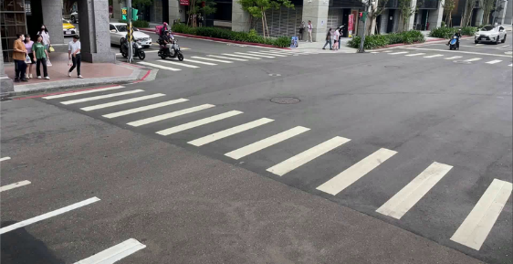
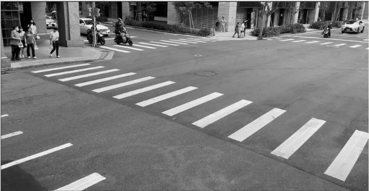
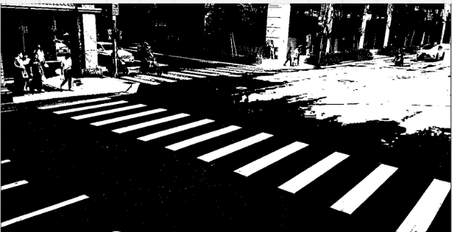
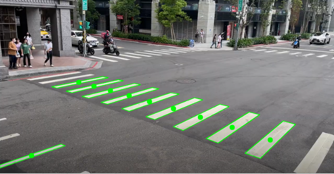
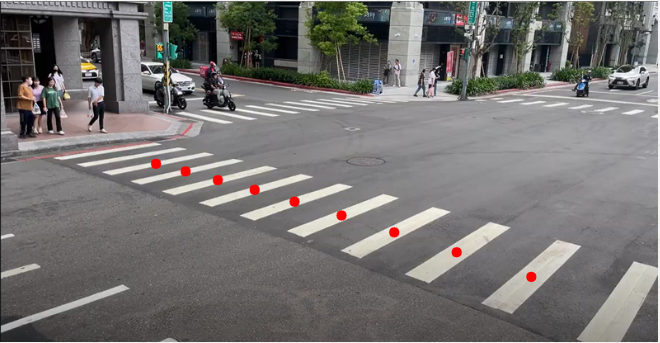
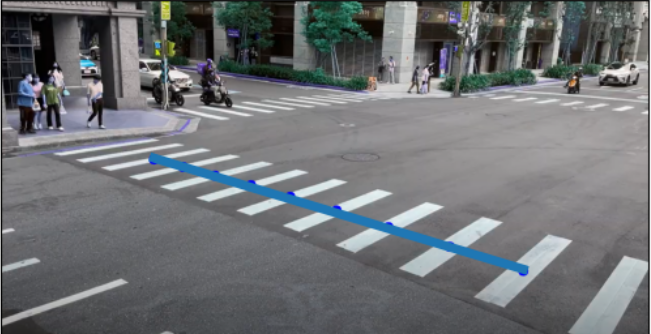
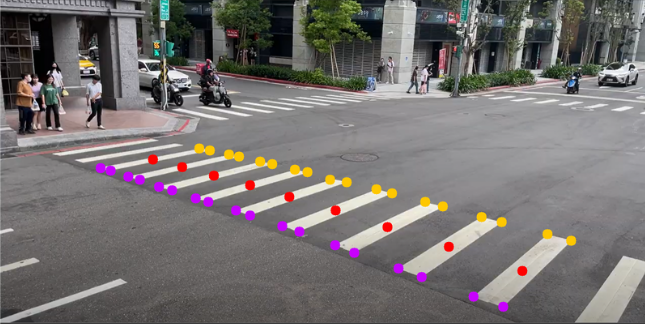
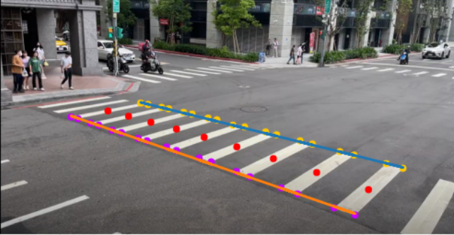

# crosswalk_identify
## 斑馬線辨識系統
* #### 研究目標：為了建構未禮讓行人違規系統。使用OpenCV結合Python進行影像處理，以找出行人穿越線邊界。
* #### 研究展望：本系統能夠同時使用在不同角度以及不同路口，為了達成這個展望，必須減少固定參數的使用
### 一、原圖
繼續看下去，讓我們找出這張圖片裡斑馬線的邊界八:)

 

### 二、將圖像灰階化
目的是為了進行後續的二值化

 

### 三、將圖像二值化
明顯區分出馬路與白色方塊的邊界

 

### 四、找出行人穿越線的輪廓與中心點
圖片中有許多輪廓，所以我們只找四邊形的輪廓，也就是只有四個角點，並且控制輪廓的面積大於100。找出符合條件的輪廓，同時使用moments圖像矩計算輪廓每個像素的X與y座標平均位置找出中心點。

 

### 五、過濾不要的中心點與輪廓
當馬路上還有其他待轉格與分隔線時，就會抓到非行人穿越線的輪廓與其中心點，所以要使用dbScan模型過濾不必要的中心點，所有中心點半徑200以內的距離必須超過3個點，才算是核心點，非核心點的中心點與輪廓會被過濾掉，只留下確定的行人穿越線的中心點與輪廓。

 

### 六、劃出中心點的擬合直線
計算所有中心點的擬合直線，計算擬合直線的斜率，以斜率決定要以x或y軸來區分上下線，斜率絕對值小於0.3以y軸區分。像以這張圖片，他的擬合直線斜率大於0趨近於1，所以以x軸區分上下線。

 

### 七、找出輪廓四邊角座標
拿出剛才計算出來的行人穿越線輪廓座標~將四個座標依x軸排序，前兩個點座標放入下線的點集合，後兩個點放入上線點集合。

 

### 八、找出行人穿越線邊界
將上線及下線的點集合找出擬合直線，就是行人穿越線的邊界啦 ~ 只要有了這兩條線的斜率與截距，未禮讓行人違規系統就完成一半了~

 

