# crosswalk_identify
## 斑馬線辨識系統
* #### 研究目標：為了建構未禮讓行人違規系統。使用OpenCV結合Python進行影像處理，以找出行人穿越線邊界。
* #### 研究展望：本系統能夠同時使用在不同角度以及不同路口，為了達成這個展望，必須減少固定參數的使用
### 一、原圖
繼續看下去，讓我們找出這張圖片裡斑馬線的邊界
<div align=center>
 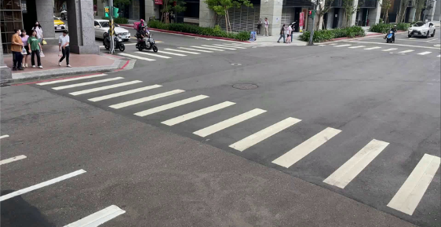
</div>

### 二、將圖像灰階化
目的是為了進行後續的二值化
```Python
def opencv_gray(self):
    gray_img = cv2.cvtColor(self.image,cv2.COLOR_BGR2GRAY)
    return gray_img
```
<div align=center>
 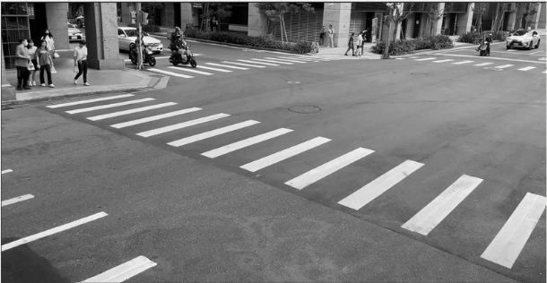
</div>

### 三、將圖像二值化
明顯區分出馬路與白色方塊的邊界。大於閾值180的像素會變為255。如果在大白天拍攝馬路會反光的話，閾值可以調高一點。
```Python
def opencv_binary(self,image):
    threshold_value = 180  # 可以根據需要調整
    max_value = 255
    _, binary_image = cv2.threshold(image, threshold_value, max_value, cv2.THRESH_BINARY)
    return binary_image
```
<div align=center>
 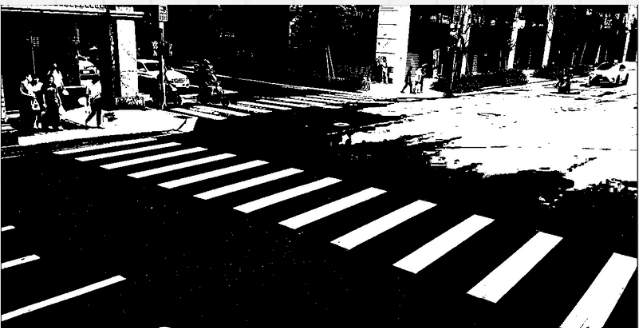
</div>

### 四、找出行人穿越線的輪廓與中心點
圖片中有許多輪廓，所以我們只找四邊形的輪廓，也就是只有四個角點，並且控制輪廓的面積大於1500。找出符合條件的輪廓，同時使用moments圖像矩計算輪廓每個像素的X與y座標平均位置找出中心點。
```Python
def opencv_contours(self,image):
    contours, hierarchy = cv2.findContours(image, cv2.RETR_TREE, cv2.CHAIN_APPROX_SIMPLE)
    # 所有要ㄉ輪廓
    approx_all=[]
    # 所有要ㄉ中心點
    point_all=[]
    #計算面積，看面積有沒有大於1500

        area=cv2.contourArea(contour)
        if area>1500:

          # 使用多邊形逼近法來取得簡化的頂點
          epsilon = 0.01 * cv2.arcLength(contour, True)
          approx = cv2.approxPolyDP(contour, epsilon, True)

          # 檢查是否為四邊形
          if len(approx) == 4:
              # 計算邊的長度比和角度，確認是否為平行四邊形
              # 計算中心點~
              M = cv2.moments(contour)
              if M['m00'] != 0:
                  cx = int(M['m10'] / M['m00'])
                  cy = int(M['m01'] / M['m00'])

                  point_all.append([cx,cy])
                  approx_all.append(approx)
    return point_all,approx_all
```
<div align=center>
 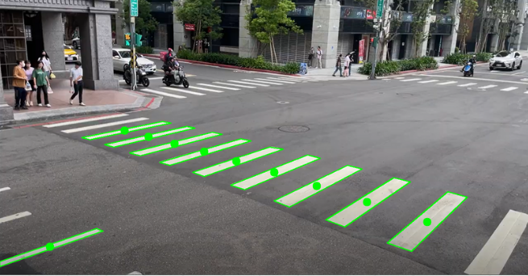
</div>

### 五、過濾不要的中心點與輪廓
當馬路上還有其他待轉格與分隔線時，就會抓到非行人穿越線的輪廓與其中心點，所以要使用dbScan模型過濾不必要的中心點，所有中心點半徑200以內的距離必須超過3個點，才算是核心點，非核心點的中心點與輪廓會被過濾掉，只留下確定的行人穿越線的中心點與輪廓。
```Python
#找到要得中心點的擬合直線，使用斜率判斷contour_line_sort演算法
  def opencv_dbscan(self,point_all,approx_all):
    pointx=[]
    pointy=[]
    contours_sort=[] # 要保留的輪廓
    # 設定 DBSCAN 參數
    epsilon = 200  # 鄰域距離閾值，視情況調整
    min_points = 3  # 至少包含的點數

    # 初始化 DBSCAN 模型
    dbscan = DBSCAN(eps=epsilon, min_samples=min_points)
    clusters = dbscan.fit_predict(point_all)

    # 輸出結果
    for i, cluster_id in enumerate(clusters):
        x,y=point_all[i]
        if cluster_id != -1:  # -1 表示噪聲
            # cv2.circle(image, (x, y), 10, (255, 0, 0), -1)
            pointx.append(x) # 要的中心點的x座標
            pointy.append(y) # 要的中心點的y座標

            contours_sort.append(approx_all[i]) #用要的中心點的index尋找輪廓
    slope=find_up_and_low_slope() 
    slope=slope.coefficients_line(pointx,pointy)
    return contours_sort,slope
# 找中心點擬合直線~
class find_up_and_low_slope:
    def coefficients_line(self,pointx,pointy):
      coefficients = np.polyfit(pointx,pointy, 1)
      linear_fit = np.poly1d(coefficients)
      slope=round(coefficients[0],3)
      intercept=round(coefficients[1],3)
      return slope,intercept
```
<div align=center>
 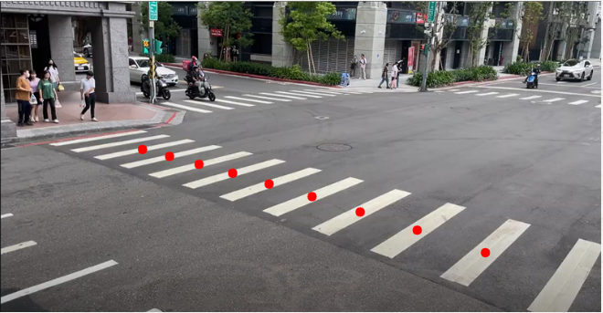
</div>

### 六、劃出中心點的擬合直線
計算所有中心點的擬合直線，計算擬合直線的斜率，以斜率決定要以x或y軸來區分上下線，斜率絕對值小於0.3以y軸區分。像以這張圖片，他的擬合直線斜率大於0趨近於1，所以以x軸區分上下線。

<div align=center>
 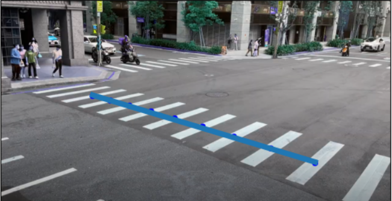
</div>

### 七、找出輪廓四邊角座標
拿出剛才計算出來的行人穿越線輪廓座標~將四個座標依x軸排序，前兩個點座標放入下線的點集合，後兩個點放入上線點集合。
<div align=center>
 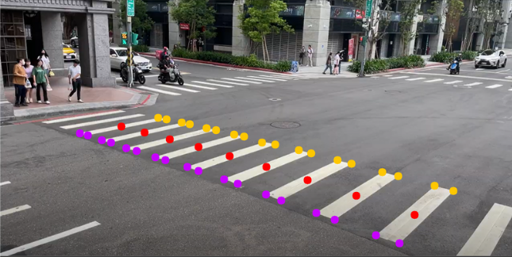
</div>

### 八、找出行人穿越線邊界
將上線及下線的點集合找出擬合直線，就是行人穿越線的邊界啦 ~ 只要有了這兩條線的斜率與截距，未禮讓行人違規系統就完成一半了~
<div align=center>
 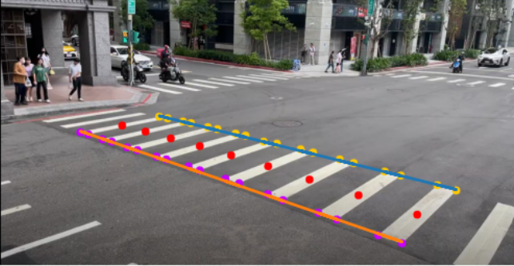
</div>

```Python
#找到上下線的點點，輸出斜率與截距
  def contour_line_sort(self,contour_sort,collabor):
    low_line_point=[]
    up_line_point=[]
    sorted_array = [sorted(myarray, key=lambda x: x[0][collabor]) for myarray in contour_sort]
    for contour in sorted_array:
      low_line_point.append(contour[:2])
      up_line_point.append(contour[2:])

    up=find_up_and_low_slope()
    up_line_slope=up.main_findupandlow_slope(up_line_point)
    low=find_up_and_low_slope()
    low_line_slope=low.main_findupandlow_slope(low_line_point)
    return up_line_slope,low_line_slope
# 以斜率區分演算法
  def slope_judge(self,contour_sort,slope):
    if abs(slope)>=0.3:
      #以x軸區分的演算法
      return self.contour_line_sort(contour_sort,0)
    else:
      #以y軸區分的演算法
      return self.contour_line_sort(contour_sort,1)
```

### 九、結果
此方法相同參數可使用在不同的路口及角度。下圖是四個不同路口的辨識結果。
|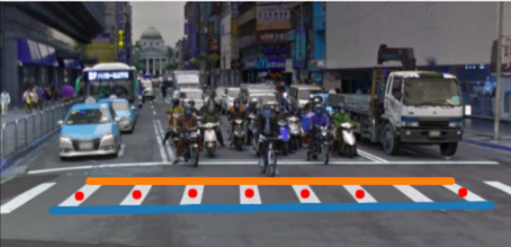|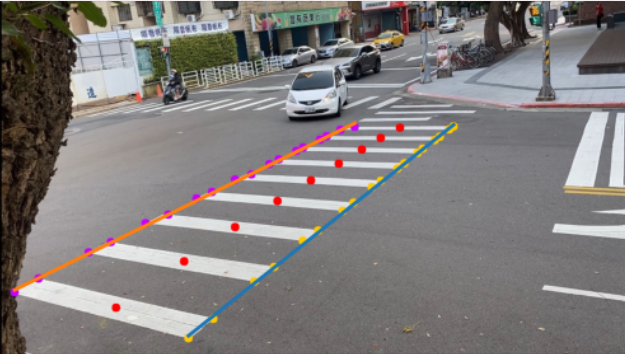|
|-------------------------------------|-------------------------|
|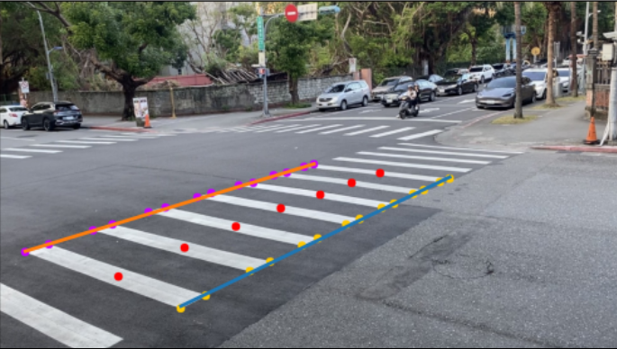|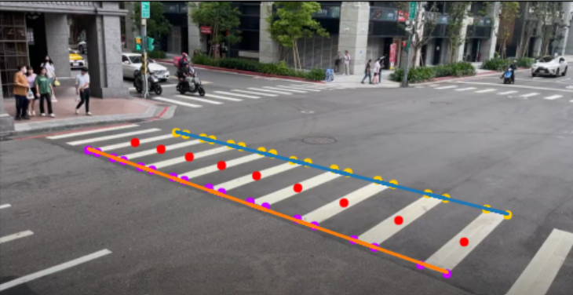| 

可以從結果看到，對於斑馬線辨識有兩大限制：
1. 角度夠高：要確定後方較遠的斑馬線能夠有更大的面積，如果角度太斜，後方的斑馬線的輪廓沒有辦法辨識成功(我們在路邊拍攝時，手伸很高舉著超長的自拍桿拍的，才能有更好的辨識效果，常常被路人盯著看@@)
2. 整個斑馬線都要入鏡：由於先前介紹到找尋輪廓時，限制只找四邊形的輪廓，如果有斑馬線輪廓卡在邊緣，像是第三四張圖片的第一個斑馬線方塊，不是一個四邊形就會在找尋輪廓及中心點時被過濾掉，辨識到的行人穿越線邊界就會不完整~
這兩個限制都是在拍攝斑馬線時，可以解決的問題，如果有好的設備(超長自拍桿、很高的同學、很穩的手)就能輕易解決~
